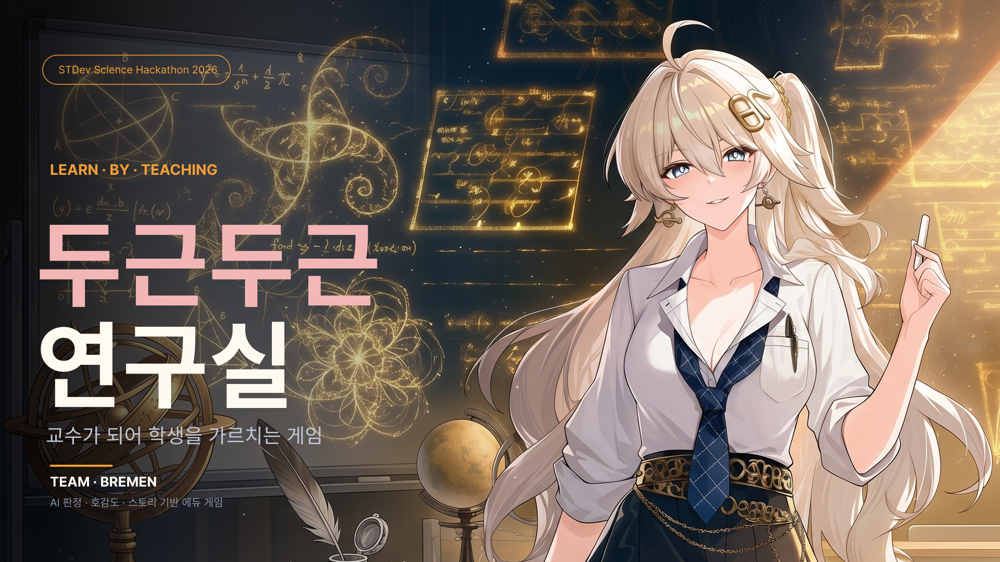
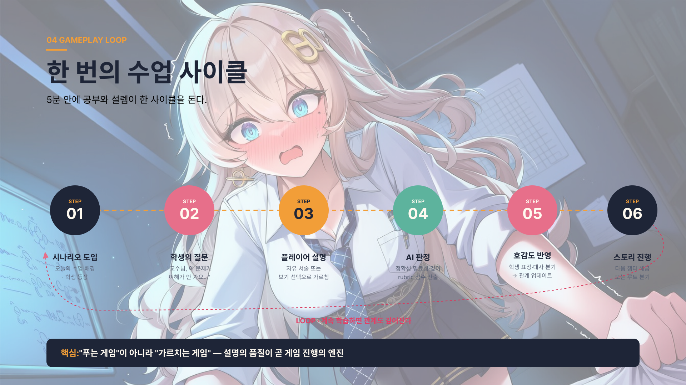
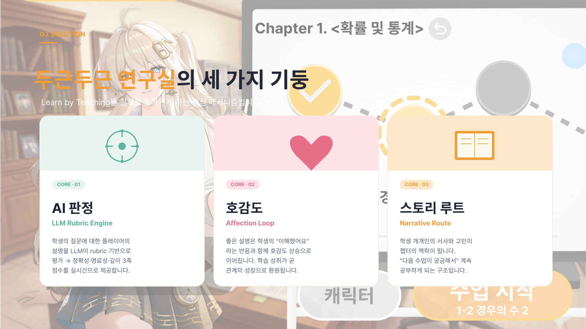
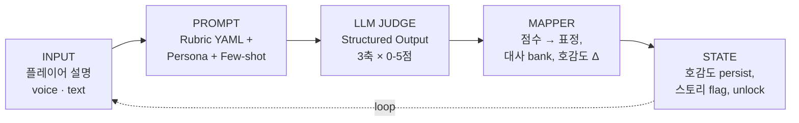
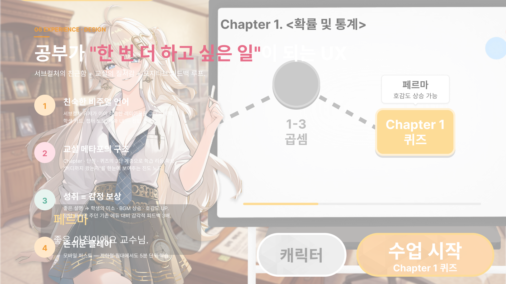
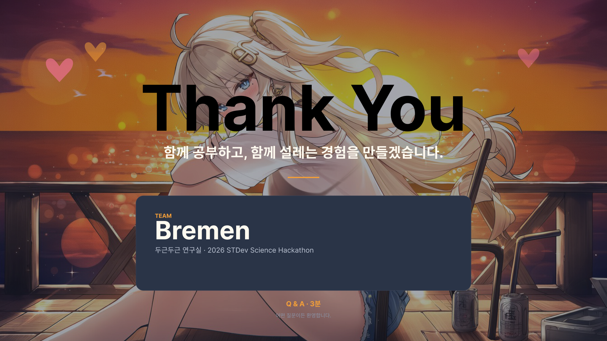

# 두근두근 연구실

[](https://nextjs.org/)
[](https://www.typescriptlang.org/)
[](https://pnpm.io/)
[](https://livekit.io/)
[](https://opensource.org/licenses/MIT)
[](#team--bremen)

> **For players:** 두근두근 연구실은 _설명해서 배우는_ 게임입니다. 문제를 푸는 대신 AI 학생에게 가르치세요.
> **For devs:** Next.js 15 + LiveKit voice agent + LLM judge를 하나의 pnpm 모노레포에서 동작하는 참조 구현입니다.

**AI 학생을 가르치는 비주얼 노벨 학습 게임. 학습자가 교수가 된다.**

_풀지 마세요. 가르치세요._

[Quick Start](#quick-start) • [Gameplay](#gameplay-loop) • [Architecture](#architecture) • [AI Judge](#ai-judge-pipeline) • [Docs](#docs) • [Team](#team--bremen)

---

## Team · Bremen

STDev 2026 Science Hackathon 출전 팀.

| Name | GitHub |
| --- | --- |
| Hyeong-soo Henry Kim | [@Hyeong-soo](https://github.com/Hyeong-soo) |
| JunHyeok Park | [@joon363](https://github.com/joon363) |
| YuRi | [@YUuRiIM](https://github.com/YUuRiIM) |
| BiQnT | [@BiQnT](https://github.com/BiQnT) |

---

## Quick Start

**Step 1: Requirements**

- Node.js `20.11+` (권장 22 LTS)
- pnpm `9+`
- Chrome / Chromium

pnpm 미설치:

```bash
corepack enable && corepack prepare pnpm@9 --activate
# 또는
brew install pnpm           # macOS
npm install -g pnpm         # Windows
```

**Step 2: Install**

```bash
git clone https://github.com/YUuRiIM/stdev_2026_bremen.git
cd stdev_2026_bremen
pnpm install
```

> `node_modules` 는 루트에서 hoisted. 각 패키지 의존성은 자동 링크.

**Step 3: Run**

```bash
pnpm dev           # Next.js FE → http://localhost:3000
pnpm agent:dev     # LiveKit voice agent (env 필요)
```

That's it. FE 만 볼 때는 `pnpm dev` 하나로 충분.

### Environment

```bash
apps/web/.env.local       # Supabase · LiveKit · Deepgram · ElevenLabs
apps/web/.env.example     # 키 목록 참고
```

Voice agent (`apps/agent`) 는 별도 env 가 없으면 `apps/web/.env.local` 을 자동 탐색 (`apps/agent/src/env-path.ts`).

---

<h1 align="center">Learn by Teaching.</h1>

<p align="center">
  
</p>

---

## Why 두근두근 연구실?

- **Feynman 원리 내장** — 가장 잘 배우는 방법은 직접 가르치는 것. 이 명제를 게임 루프로 구현했습니다.
- **AI 채점이 실제로 동작** — LLM rubric 엔진이 정확성·명료성·깊이 3축으로 실시간 평가.
- **감정 보상 내장** — 좋은 설명은 학생의 미소 · BGM 상승 · 호감도 UP 으로 돌아옵니다.
- **스토리가 엔진** — 학생 개개인의 서사가 챕터 컨텍스트가 되어 "다음 수업"을 궁금하게 만듭니다.
- **모바일 퍼스트** — 지하철·침대에서도 5분 단위 학습 사이클.
- **오픈 모노레포** — FE · voice agent · shared judge 엔진이 한 레포 안에서 돈다. 각 파트 독립 실행 가능.

---

## Gameplay Loop

한 번의 수업 사이클 — 5분 안에 공부와 설렘이 한 바퀴 돕니다.

<p align="center">
  
</p>

| Step | Phase | What happens |
| :---: | :--- | :--- |
| **01** | Scenario | 오늘의 수업 배경 · 학생 등장 |
| **02** | Question | "교수님, 이 문제가 이해가 안 가요..." |
| **03** | Teach | 자유 서술 또는 보기 선택으로 가르침 |
| **04** | Judge | LLM이 정확성·명료성·깊이 3축 × 0–5점 채점 |
| **05** | Affection | 점수 → 표정 state · 대사 bank · 호감도 Δ |
| **06** | Story | 다음 챕터 해금 또는 루트 분기 |

> 핵심: "푸는 게임"이 아니라 **"가르치는 게임"**. 설명의 품질이 곧 게임 진행의 엔진.

---

## Three Pillars

<p align="center">
  
</p>

| Pillar | What it is | Implementation |
| :--- | :--- | :--- |
| **AI 판정** | LLM Rubric Engine — 자유 서술 설명을 rubric 기반으로 평가, 3축 × 0–5점 | `packages/shared/judge/` |
| **호감도** | Affection Loop — 점수 → 표정·대사 분기 → 관계 업데이트 | `packages/shared/affection/` |
| **스토리 루트** | Narrative Route — 학생 서사가 챕터 맥락, 루트 분기 유발 | `apps/web/visual-novel/` |

---

## AI Judge Pipeline

평가는 실제로 동작합니다. INPUT부터 STATE까지 5-stage 파이프라인.

<p align="center">
  
</p>



| Stage | Input | Output | Path |
| :--- | :--- | :--- | :--- |
| **INPUT** | 플레이어 자유 서술 · 선택지 · 챕터 컨텍스트 | raw text + metadata | `apps/web`, `apps/agent` |
| **PROMPT** | subject slug + rubric YAML + persona prefix | 완성된 judge prompt | `packages/shared/prompts/` |
| **JUDGE** | prompt | `{accuracy, clarity, depth}` 각 0–5 (JSON) | `packages/shared/judge/` |
| **MAPPER** | judge 결과 | 표정 state · 대사 id · 호감도 delta | `packages/shared/affection/` |
| **STATE** | delta · flag | 호감도 persist, 스토리 flag, 챕터 unlock | Supabase + drizzle + Zustand |

---

## Architecture

pnpm workspace + Turborepo 기반 모노레포. 각 패키지는 독립적으로 테스트·실행 가능합니다.

```
stdev_2026_bremen/
├── apps/
│   ├── web/                  @bremen/web     Next.js 15 App Router (게임 FE)
│   └── agent/                @mys/agent      LiveKit voice worker
├── packages/
│   └── shared/               @mys/shared     drizzle · prompts · judge · affection
├── docs/
│   ├── pitch/                                발표 자료 (8 slides)
│   ├── nextjs-integration-handoff.md
│   ├── demo-script.md
│   ├── content-authoring-guide.md
│   └── plans/                                sprint 플랜 문서
├── pnpm-workspace.yaml
├── turbo.json
└── tsconfig.base.json
```

<details>
<summary><b>Package responsibilities</b></summary>

### `apps/web` — 게임 프론트엔드

- Next.js 15 App Router · React 19
- 7 screens: 홈 · 선택 · 확정 · 로비 · 상세 · 레슨 · 비주얼 노벨
- Tailwind CSS · Framer Motion · Zustand (game state)
- 4-layer 캐릭터 합성 렌더러 (manifest 기반)

### `apps/agent` — LiveKit Voice Agent

- 실시간 음성 스트리밍 — Deepgram STT → LLM → ElevenLabs TTS
- `agent.turn_text`, `agent.inner_monologue` 데이터 채널 토픽
- ConversationItemAdded publish, TTS markup strip
- subject preload, judge 호출 흐름 조율

### `packages/shared` — 공용 엔진

- `drizzle/` — DB 스키마 (user · progress · affection · chapter)
- `prompts/` — rubric YAML + 페르소나 prefix + few-shot
- `judge/` — LLM 채점 엔진 (Gemini / Claude / GPT 지원)
- `affection/` — 점수 → 호감도 delta 매핑
- `subjects/` — 교과 seed (사칙연산 · 소수 · 페르마 소정리)
- `tools/`, `protocol/` — agent ↔ web 데이터 채널 스키마

</details>

---

## Commands

루트에서 실행하는 주요 명령 모음.

| Command | Purpose | Notes |
| :--- | :--- | :--- |
| `pnpm dev` | Next.js FE 개발 서버 | `http://localhost:3000` |
| `pnpm build` | FE 프로덕션 빌드 | `.next/` 생성 |
| `pnpm lint` | FE lint | |
| `pnpm typecheck` | 전체 패키지 typecheck | recursive (-r) |
| `pnpm agent:dev` | LiveKit voice agent | env 필요 |
| `pnpm agent:smoke` | agent plugin 스모크 | `SILERO_SKIP_LOAD=1` |
| `pnpm shared:test` | judge/affection unit tests | 12 tests |
| `pnpm shared:typecheck` | shared 단독 typecheck | |

패키지 단독 실행:

```bash
pnpm --filter @bremen/web dev
pnpm --filter @mys/agent dev
pnpm --filter @mys/shared test
```

---

## Page Map

FE 라우트와 소스 위치.

| Route | Screen | Source |
| :--- | :--- | :--- |
| `/` | 홈 | `apps/web/app/page.tsx` |
| `/select` | 캐릭터 선택 | `apps/web/app/select/page.tsx` |
| `/confirm` | 선택 확인 | `apps/web/app/confirm/page.tsx` |
| `/lobby` | 메인 로비 (교수실) | `apps/web/app/lobby/page.tsx` |
| `/detail` | 캐릭터 상세 | `apps/web/app/detail/page.tsx` |
| `/lesson/[subject]` | 레슨 · 퀴즈 | `apps/web/app/lesson/` |
| `/visual-novel/[scriptId]` | 비주얼 노벨 | `apps/web/app/visual-novel/[scriptId]/page.tsx` |

공통 레이아웃 · 전역 CSS · 에셋:

| Purpose | Path |
| :--- | :--- |
| Layout | `apps/web/app/layout.tsx` |
| Global CSS | `apps/web/app/globals.css` |
| Components | `apps/web/components/` |
| Script JSON | `apps/web/data/script-*.json` |
| Dummy characters | `apps/web/data/dummyCharacters.ts` |
| Assets | `apps/web/public/assets/` |

---

## Content Authoring

퀴즈·강의 주제 작성 가이드는 [`docs/content-authoring-guide.md`](docs/content-authoring-guide.md) 참고.

현재 Chapter 구성:

| Chapter | Subject | Status |
| :--- | :--- | :--- |
| 1 | 사칙연산 (덧셈 · 뺄셈 · 곱셈) | ✅ |
| 2 | — | 예정 |
| 3 | 소수 | ✅ |
| 4 | 페르마 소정리 | ✅ |

rubric 은 subject 별 YAML 로 `packages/shared/prompts/` 에 위치.

---

## Design Philosophy

공부가 "한 번 더 하고 싶은 일"이 되는 UX.

<p align="center">
  
</p>

| # | Principle | Why |
| :---: | :--- | :--- |
| **1** | 친숙한 비주얼 언어 | 서브컬처 유저가 이미 학습한 레이아웃 — 진입 장벽 0 |
| **2** | 교실 메타포 구조 | Chapter · 단원 · 퀴즈 3단 계층으로 학습 리듬 확보 |
| **3** | 성취 = 감정 보상 | 좋은 설명 → 학생 미소 · BGM 상승 · 호감도 UP |
| **4** | 모바일 퍼스트 | 지하철·침대에서도 5분 단위 학습 |

---

## Market Position

서브컬처 게임의 몰입 × 에듀테크의 지속성.

| Market | Scale / Growth | Behavior |
| :--- | :--- | :--- |
| 서브컬처 게임 | 국내 MAU 400만+ | 캐릭터 애착 + 스토리 · 강한 과금 의향 |
| **두근두근 연구실** | _intersection_ | _공부를 계속하게 만드는 감정_ |
| 에듀테크 | 글로벌 CAGR 13% | 자기주도 학습 수요 · 학부모 결제 의사 |

---

## Development Workflow

1. `main` 에서 feature 브랜치 생성 (`feat/...` 또는 `fix/...`)
2. `apps/web/` 안에서 작업
3. `pnpm dev` 로 로컬 확인 → `pnpm build` 통과 확인
4. 커밋 → push → PR (base: `main`)
5. 리뷰 승인 후 squash merge (권장)

### Branches

- `main` — 릴리즈 브랜치
- `my-app-legacy` — CRA 시절 스냅샷 (롤백 레퍼런스, 머지 금지)
- `feat/*`, `fix/*`, `chore/*` — 작업 브랜치

### Stack History

- **Stack 0** — CRA → Next.js 15 마이그레이션 (`feat/next-port`)
- **Stack 1** — 7 screens App Router 포팅
- **Stack 2** — pnpm workspace + Turborepo 모노레포 구조화
- **Stack 3** — LiveKit voice agent + LLM judge 통합 (현재)
- **Next** — 챕터 확장 · 추가 캐릭터 루트

상세 계획: [`docs/nextjs-integration-handoff.md`](docs/nextjs-integration-handoff.md) · [`docs/plans/`](docs/plans/)

---

## Docs

| Document | Purpose |
| :--- | :--- |
| [`docs/nextjs-integration-handoff.md`](docs/nextjs-integration-handoff.md) | Next.js 마이그레이션 기록 |
| [`docs/demo-script.md`](docs/demo-script.md) | 데모 진행 시나리오 |
| [`docs/content-authoring-guide.md`](docs/content-authoring-guide.md) | 퀴즈·강의 주제 작성 가이드 |
| [`docs/plans/`](docs/plans/) | Sprint 플랜 및 의사결정 로그 |
| [`docs/pitch/`](docs/pitch/) | 발표 자료 (8 slides) |

---

## Tech Stack

**Frontend** Next.js 15 · React 19 · TypeScript 5.6 · Tailwind CSS · Framer Motion · Zustand
**Voice** LiveKit · Deepgram STT · ElevenLabs TTS
**AI Judge** OpenAI · Claude · Gemini (swappable)
**Data** Supabase · drizzle ORM
**Tooling** pnpm 9 · Turborepo · Vitest
**Character** Live2D / Spine (planned)

---

## Team · Bremen

<p align="center">
  
</p>

**두근두근 연구실** — 2026 STDev Science Hackathon · Team Bremen
_함께 공부하고, 함께 설레는 경험을 만들겠습니다._

---

## License

MIT. `LICENSE` 파일 참조.

---

<p align="center">
  <sub>Built for learners who'd rather teach.</sub><br/>
  <sub>Next.js · TypeScript · LiveKit · OpenAI · Claude · Gemini · Supabase · Zustand · Tailwind</sub>
</p>
